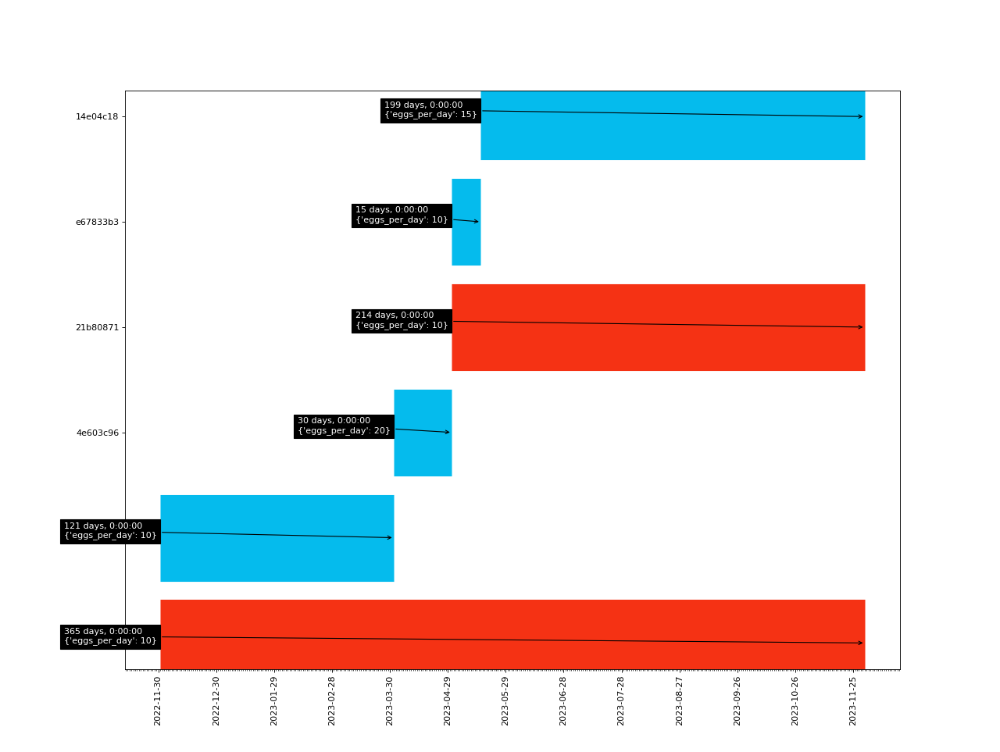

# pcontract

A data structure to track data over time. It works by tracking time/schedule
information **rather than tracking data changes** over time.


## Reasoning

Let's assume you make a contract with a person (in this example,
assume it's a lease agreement). In the first draft, the  parties agree on
some conditions, and if they are happy, they close the deal.

Now, assume after some time, one of the parties need to amend some
changes, (after the fact that the contract was in place), in which case the
original contract would be nulled and a new contract would be drafted.
This new contract now spans a different time period and the conditions are
changed.

In this case the tenant would have held of the leased place for some time
(say a month) until the amended contract was in place.

To account for this interval, amended contract could be drafted so that it would
encompass the past month.

However, the world of leasing is not perfect and sometimes one of the parties
will need to pursue this one-month interval according to the original contract
(e.g., the landlord increased the rent, but it will become effective in the
coming month). In such a case, there needs to be a contract for the one-month
interval since the original contract spans more than that.

As such, we need a way to create contracts and amend them without having to
think about these intervals; things get more complex if the amending is not
permanent but transitory (e.g., effective only for some limited time during
the original contract).

## How it works

In order to create a contract, you need to use a `Collection` type, which is a
container for `Branch` i.e, contracts. You may initialize a basic contract by:

```python
collection = Collection.init(
    start_at=datetime(2022, 12, 1),
    end_at=datetime(2023, 12, 1),
    data={"hello": "world"},
)
```

The example above creates a contract that spans one year, with given data. In
order to amend a contract, you may use `Collection.branch`:

```
collection.branch(
    start_at=datetime(2023, 6, 1),
    data={"hello": "moon"}
)
```

This change will create additional branches that describe the data over time.
You may see the branch information by using the `Collection.explain` method.
The example above will create a total of three contracts:

- One for the original contract (spanning 1 year).
- One for the interval between original start and amended start.
- One for the interval between amended start and amended end.

The first contract will be disabled since it won't be relevant in after the
latest changes.


## Example

Jack is a farmer that sells eggs, and Janet is a baker that sells cakes (using
eggs, obviously). Jack and Janet make a contract in which Jack agrees to provide
Janet 10 eggs every day, for one year.

```python
collection = Collection.init(
    start_at=datetime(2022, 12, 1),
    end_at=datetime(2023, 12, 1),
    data={"eggs_per_day": 10},
)
```

A couple of months pass, and Janet realizes that the easter is coming,
in which period cake requests are doubled. Now Janet needs 20 eggs per day,
instead of the usual 10. So a new agreement is made in which Janet would receive
20 eggs a day during the easter period:

```python
collection.branch(
    start_at=datetime(2023, 4, 1),
    end_at=datetime(2023, 5, 1),
    data={"eggs_per_day": 20},
)
```

Shortly after the easter period, Janet sees an increase in sales thanks to the
delicious cakes she sold during the easter period. So she makes a new agreement
with Jack in which the number of eggs per day is increased to 15:

```python
collection.branch(
    start_at=datetime(2023, 5, 16),
    data={"eggs_per_day": 15},
)
```

Now let's look at what happened, output from `collection.gantt()`:



In the example above, each line represents a contract (hence a `Branch`instance)
you can track how the date changes by following blue lines. Red lines indicate
contracts that were replaced by newer ones (i.e., they are no longer relevant).
